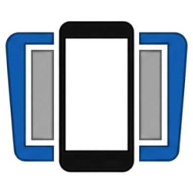
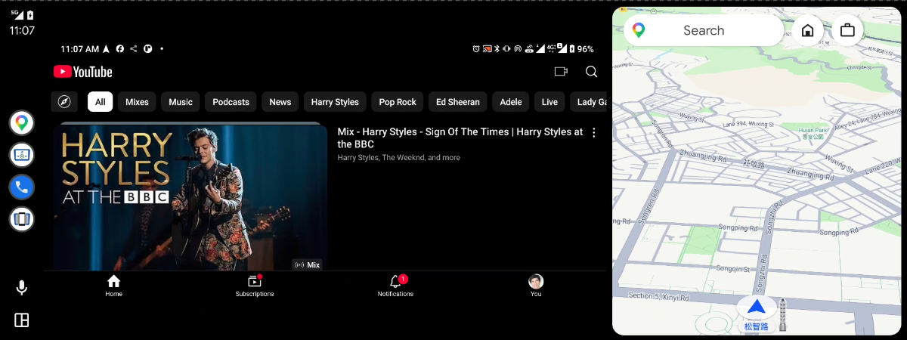
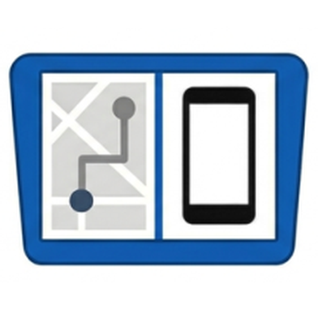

#  ScreenOnAuto

[English](../README.md) | [繁體中文](README.zh-TW.md) | [Português (Brasil)](README.pt-BR.md) | [Español](README.es.md) | [Deutsch](README.de.md) | [Français](README.fr.md) | [Italiano](README.it.md) | [Türkçe](README.tr.md) | [العربية](README.ar.md)

*🌐 [공식 웹사이트](https://screenonauto.lzn.idv.tw/ko/)*

> Android 휴대전화 화면을 Android Auto 디스플레이에 미러링하고, 미디어 버튼 제어도 지원합니다.
>
> **무료로 사용할 수 있으며, 추가 결제가 필요한 기능은 없습니다.**

> [!IMPORTANT]
> **설치 방법은 Android 버전에 따라 다릅니다:**
> - **Android 14 이상** — **Google Play로만** 설치: 30분마다 열리는 회차에 신청하고 25분 안에 설치하세요(앱은 Play 스토어에서 **검색되지 않습니다**). [신청하기 →](https://screenonauto.lzn.idv.tw/join/?lang=ko)
> - **Android 13 이하** — KingInstaller로 APK를 사이드로드하거나([아래 단계](#설치)), Google Play로 설치합니다.

## 기능

- **화면 미러링** — 휴대전화 화면을 실시간으로 캡처해 Android Auto 헤드유닛에 미러링합니다
- **미디어 세션 프록시** — Android Auto의 기본 미디어 화면에서 휴대전화의 모든 미디어 앱을 제어합니다
- **자동 화면 어둡게** — 미러링 중 조작이 없으면 휴대전화 밝기를 자동으로 낮춥니다 (15/30/60/120초 지연)
- **자동 미러링 시작** — Android Auto가 연결되면 자동으로 미러링을 시작합니다
- **외부 제어** — 자동화 앱, 바로가기 또는 ADB에서 인텐트로 미러링을 시작·중지·전환합니다 — [다른 앱에서 미러링 제어](https://github.com/slzn/ScreenOnAuto-releases/wiki/다른-앱에서-미러링-제어)
- **절전 방지** — 미러링 중 휴대전화 화면이 꺼지지 않도록 합니다
- **연결 해제 시 중지** — Android Auto 연결이 끊기면 미러링을 자동으로 중지합니다
- **앱 자동 실행** — 미러링이 시작되고 Android Auto가 연결되어 있으면 지정한 앱을 휴대전화에서 자동으로 실행합니다
- **이 앱만 미러링** *(Android 15+)* — 전체 화면 대신 자동 실행 앱만 차량으로 보내므로 휴대전화의 나머지 부분은 차량에 나타나지 않습니다. 화면 캡처 권한을 [ADB로 미리 부여](https://github.com/slzn/ScreenOnAuto-releases/wiki/ADB로-미러링-권한-부여)해야 하며, 해당 앱에서 벗어나 있는 동안에는 차량 화면이 비어 있습니다
- **가로 모드 강제** — 미러링 중 휴대전화를 가로 모드로 고정합니다. 연결 시 자동으로 적용되며 화면 버튼으로 전환할 수 있습니다
- **실행 바로가기** — Android Auto 미러링 화면에 최대 4개의 앱 실행 버튼을 추가합니다
- **화면 버튼** — 화면 버튼 페이지에서 미러링 화면의 버튼을 개별적으로 표시하거나 숨깁니다: 가로 모드 강제, 자동 화면 어둡게, 그리고 휴대전화의 뒤로 / 홈 / 최근 앱 (동시에 최대 4개)
- **버튼 위치** — Legacy 미러링에서 화면 버튼을 왼쪽으로 정렬하거나, 휴대전화 내비게이션 바를 자동으로 피하게 합니다
- **미러링 화면 조정** — 가장자리가 잘리는 헤드유닛을 위해 고급 설정에서 미러링 너비와 높이를 조정합니다. 같은 곳의 실험적 기능인 **직접 그리기 미러링**은 분할 화면에서의 왜곡도 막아 줍니다
- **터치 전달** *(실험적)* — Android Auto 화면에서 탭, 스크롤, 플링, 핀치 줌으로 휴대전화를 조작합니다

## 특권 기능

선택 사항 — [Shizuku](https://shizuku.rikka.app/) 또는 루트가 필요합니다. 둘 다 없어도 나머지 기능은 그대로 작동합니다.

| 기능 | 하는 일 |
|---|---|
| **휴대전화 화면 끄기** | 자동 화면 어둡게가 작동할 때 휴대전화 패널을 끄고, 차량 화면에는 미러링이 계속 표시됩니다 — 배터리를 아끼고, 밤에 휴대전화가 실내를 밝히는 것을 막아 줍니다 |
| **실제 터치 입력 주입** | 합성된 제스처 대신 실제 손가락 움직임을 전달하므로 Legacy 미러링에서 **길게 누르기, 드래그, 멀티터치**가 동작합니다 |
| **휴대전화 내비게이션 버튼** | **접근성 서비스를 전혀 켜지 않아도** 뒤로 / 홈 / 최근 앱이 동작합니다. **화면 버튼 → 기능 버튼**에서 켜세요 |
| **휴대전화 화면을 차량 화면 비율에 맞추기** | 미러링 중 휴대전화 화면을 차량 디스플레이의 화면 비율로 바꿔 검은 여백과 분할 화면의 왜곡을 원인 단계에서 없앱니다 — 차량 화면은 자동으로 측정됩니다 |

차량에 연결하자 Shizuku가 멈췄거나 화면이 다시 켜지지 않나요? [문제 해결](https://github.com/slzn/ScreenOnAuto-releases/wiki/사용-방법#문제-해결)을 참고하세요.

## 요구 사항

- Android 7.0 (API 24) 이상
- 휴대전화에 Android Auto 설치
- Android Auto를 지원하는 차량
- *(선택 사항)* [Shizuku](https://shizuku.rikka.app/) 또는 루트 — [특권 기능](#특권-기능)을 사용하려면 필요합니다

## 설치

### Android 14 이상 — Google Play로 설치

Android Auto는 Play 스토어에서 설치한 앱만 실행하며, Android 14 이상에서는 KingInstaller 우회 방법이 차단됩니다. 따라서 Google Play 내부 테스트로 설치하세요. GitHub 버전과 같은 전체 앱이지만 Play 스토어에서 검색되지는 않습니다. [**설치 페이지에서 신청**](https://screenonauto.lzn.idv.tw/join/?lang=ko)하세요. 30분마다 새 회차가 열리며, 회차가 시작되면 설치 링크가 나타납니다. 전체 단계: [**베타 테스트 참여**](https://github.com/slzn/ScreenOnAuto-releases/wiki/베타-테스트-참여).

### Android 13 이하 — KingInstaller로 사이드로드

> **왜 KingInstaller인가요?**  
> Android Auto는 Google Play 스토어를 통해 설치된 앱을 요구합니다.
> APK를 직접 설치하면 설치 출처가 브라우저나 파일 관리자로 기록되어 Android Auto가
> 거부합니다. KingInstaller는 설치 출처를 Google Play 스토어로 보고하면서 APK를
> 설치합니다.

#### 1단계 — KingInstaller 설치

1. [KingInstaller 릴리스](https://github.com/fcaronte/KingInstaller/releases)에서 최신 `KingInstaller.apk`를 내려받습니다
2. 브라우저나 파일 관리자에서 **알 수 없는 앱 설치**를 허용하세요 — APK를 처음 열 때 Android가 물어봅니다
3. `KingInstaller.apk`를 열고 **설치**를 누릅니다

#### 2단계 — KingInstaller로 ScreenOnAuto 설치

1. [최신 릴리스](https://github.com/slzn/ScreenOnAuto-releases/releases/latest)에서 최신 `ScreenOnAuto-*.apk`를 내려받습니다
2. **KingInstaller**를 열고 **폴더 아이콘**을 눌러 내려받은 APK를 선택합니다
3. **설치**를 누릅니다 — KingInstaller가 Google Play 스토어에서 온 것처럼 설치해 줍니다

#### 3단계 — 권한 부여

**ScreenOnAuto**를 실행하고 앱 안내에 따라 필요한 권한을 부여하세요.

## Android Auto에서 확인

**설치 방법과 관계없이** 동일합니다 — KingInstaller 사이드로드든 Google Play든 마찬가지입니다.

휴대전화에서 **설정 → 연결된 기기 → Android Auto → 런처 맞춤설정**으로 이동하세요.
ScreenOnAuto 항목 **두 개**가 보여야 합니다:

| 아이콘 | 이름 | 기능 |
|---|---|---|
|  | **ScreenOnAuto** | 휴대전화 화면을 전체 화면으로 미러링합니다 — 지도 영역을 대체해 전체 화면으로 표시합니다 |
|  | **ScreenOnAuto (Legacy)** | Legacy 프로젝션 경로로 휴대전화 화면을 미러링합니다 — 지도와 나란히 표시할 수 있습니다 |

이전 버전의 Android Auto에서는 세 번째 항목인 **ScreenOnAuto 미디어 컨트롤러**도 표시됩니다. 보이지 않아도 정상이며, 미디어 제어는 그대로 작동합니다.
위의 **두** 항목 중 하나라도 없다면, 사이드로드는 KingInstaller로 다시 설치하고 Play 설치는 설치가 끝났는지 확인한 뒤 Android Auto를 다시 여세요.

준비되셨나요? 차량에서 미러링을 시작하는 방법은 **[사용 방법](https://github.com/slzn/ScreenOnAuto-releases/wiki/사용-방법)** 을 참고하세요.

## 권한

| 권한 | 필요한 기능 |
|---|---|
| 화면 캡처 (MediaProjection) | 화면 미러링 |
| 알림 접근 권한 | 미디어 세션 프록시 |
| 다른 앱 위에 표시 | 자동 화면 어둡게 및 가로 모드 강제 |
| 접근성 서비스 | 터치 전달 및 뒤로 / 홈 / 최근 앱 버튼 (특권 기능 사용 시 불필요) |

> **팁:** 실행할 때마다 나오는 화면 캡처 권한 대화상자를 피하려면 ADB로 미리 권한을 부여할 수 있습니다 — [ADB로 미러링 권한 부여](https://github.com/slzn/ScreenOnAuto-releases/wiki/ADB로-미러링-권한-부여)를 참고하세요. 이것으로 **이 앱만 미러링**도 사용할 수 있게 됩니다.

## 알려진 제한 사항

- **미러링 중에는 휴대전화 화면이 켜져 있어야 합니다** — 미러링은 휴대전화 화면에 보이는 내용을 보여 줍니다. **절전 방지**로 화면을 켜 두고 **자동 화면 어둡게**로 배터리를 아끼세요. Shizuku 또는 루트가 있으면 휴대전화 화면 끄기로 이 제한을 없앨 수 있습니다.
- **DRM으로 보호된 콘텐츠는 미러링할 수 없습니다** — Netflix나 Disney+ 같은 앱은 미러링 화면에 검은 화면으로 표시됩니다. 이는 앱이 우회할 수 없는 Android 플랫폼의 제약입니다.
- 차량 화면의 **Android Auto 내비게이션 바**는 Android Auto가 직접 그리는 것이라 숨길 수 없습니다.

## 면책 조항

항상 전방을 주시하세요 — 운전 중에는 이 앱을 조작하지 마세요.

이 프로젝트는 Google과 제휴, 보증 또는 후원 관계가 없습니다. Android Auto는 Google LLC의 상표입니다.

## 특별 감사

- **Jurek Harla** — Android의 둥근 아이콘 모양에 맞도록 ScreenOnAuto, ScreenOnAuto (Legacy), 미디어 컨트롤러 아이콘을 새로 디자인해 주셨습니다 (v1.9.2).

## 후원

이 앱이 유용하다면 후원하거나 버블티 한 잔 사 주세요 🧋

