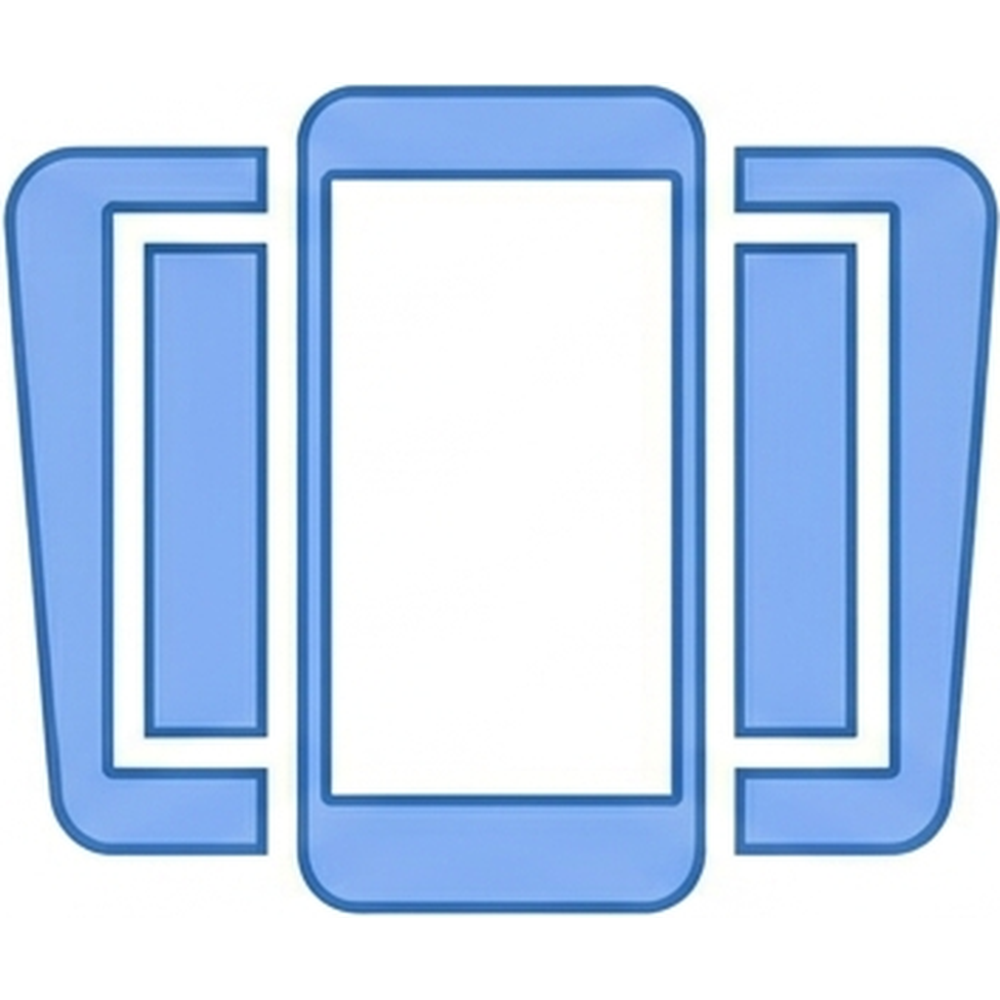
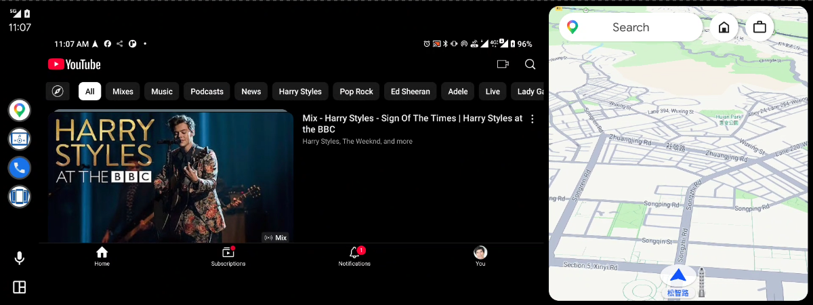
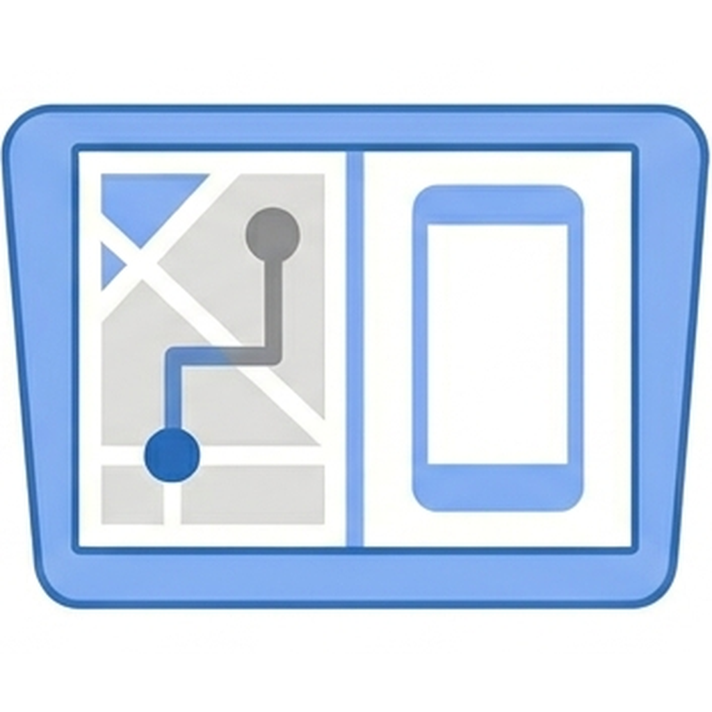

#  ScreenOnAuto

[English](../README.md) | [繁體中文](README.zh-TW.md) | [Português (Brasil)](README.pt-BR.md) | [Español](README.es.md) | [Deutsch](README.de.md) | [Français](README.fr.md) | [Italiano](README.it.md) | [العربية](README.ar.md)

*🌐 [Resmî web sitesi](https://screenonauto.lzn.idv.tw/tr/)*

> Android telefonunuzun ekranını Android Auto ekranına yansıtın; medya düğmesi kontrolleri de desteklenir.
>
> **Kullanımı ücretsizdir. Hiçbir özellik ek ödeme gerektirmez.**

> [!IMPORTANT]
> **Kurulum yönteminiz Android sürümünüze bağlıdır:**
> - **Android 14 ve üzeri** — yalnızca **Google Play** üzerinden kurulum (davetiyeli — uygulama Play Store'da **aranarak bulunamaz**). [Test kullanıcısı listesine katılın →](https://github.com/slzn/ScreenOnAuto-releases/wiki/Beta-Testine-Katılın)
> - **Android 13 ve altı** — APK'yı KingInstaller ile elle yükleyin ([adımlar aşağıda](#kurulum)) veya Google Play üzerinden kurun.

## Özellikler

- **Ekran Yansıtma** — Telefon ekranınızı gerçek zamanlı olarak Android Auto araç ekranına yansıtın
- **Medya Oturumu Aracısı** — Telefondaki herhangi bir medya uygulamasını Android Auto'nun yerleşik medya arayüzünden kontrol edin
- **Otomatik Karartma** — Yansıtma boştayken telefon ekranı parlaklığını otomatik olarak düşürün (15/30/60/120 sn gecikme)
- **Otomatik Başlatma** — Android Auto bağlandığında yansıtmayı otomatik olarak başlatın
- **Uykuyu Engelleme** — Yansıtma sırasında telefon ekranının uykuya geçmesini engelleyin
- **Bağlantı Kesilince Durdurma** — Android Auto bağlantısı kesildiğinde yansıtmayı otomatik olarak durdurun
- **Uygulamayı Otomatik Başlatma** — Yansıtma başladığında ve Android Auto bağlıyken seçtiğiniz bir uygulamayı telefonda otomatik olarak açın
- **Yatay Modu Zorlama** — Yansıtma sırasında telefonu yatay moda zorlayın; bağlantıda otomatik başlar, ekranda aç/kapat düğmesi vardır
- **Başlatma Kısayolları** — Android Auto yansıtma ekranına en fazla 4 hızlı uygulama başlatma düğmesi ekleyin
- **Ekran Düğmeleri** — Yansıtma ekranındaki düğmeleri Gelişmiş ayarlardan tek tek gösterin veya gizleyin: Yatay modu zorla, Otomatik karartma ve telefonun Geri / Ana ekran / Son uygulamalar düğmeleri (aynı anda en fazla 4)
- **Düğme Konumu** — Legacy yansıtmada düğmeleri sola hizalayın veya telefonun gezinme çubuğundan otomatik olarak kaçının
- **Yansıtma Ayarı** — Kenarları kesen araç ekranları için Gelişmiş ayarlardan yansıtma genişliğini/yüksekliğini kırpın
- **Dokunma Aktarımı** *(Deneysel)* — Telefonunuzu kontrol etmek için Android Auto ekranına dokunun, kaydırın, savurun ve iki parmakla yakınlaştırın

## Ayrıcalıklı özellikler

Bunlar, normal Android API'lerinin yapamadıklarını açar. **[Shizuku](https://shizuku.rikka.app/) veya root** gerektirir ve tamamen isteğe bağlıdır: telefonunuzda ikisi de yoksa **hiçbir şey değişmez** — bölüm gizli kalır ve diğer tüm özellikler tam olarak eskisi gibi çalışır.

| Özellik | Ne yapar |
|---|---|
| **Telefon ekranını kapat** | Otomatik Karartma devreye girdiğinde telefonun panelini kapatır, araç ise yansıtmayı göstermeye devam eder — pil tasarrufu sağlar ve gece telefonun kabini aydınlatmasını önler |
| **Gerçek dokunma enjeksiyonu** | Sentezlenmiş hareketler yerine gerçek parmak hareketlerinizi aktarır; böylece **uzun basma, sürükleme ve çoklu dokunma** Legacy yansıtmasında çalışır |
| **Telefon gezinme düğmeleri** | Geri / Ana ekran / Son uygulamalar **hiçbir Erişilebilirlik Hizmeti etkin olmadan** çalışır |

> [!IMPORTANT]
> **ADB ile başlatılan bir Shizuku sunucusu, USB ile bağlandığınızda kapanabilir.** Android Auto'ya USB bağlantısı telefonu aksesuar moduna alır; bu da ADB'yi yeniden başlatır ve Shizuku sunucusunu da beraberinde götürebilir. Kablosuz hata ayıklama bunu önlemez — ikisi de aynı ADB üzerinden çalışır. Ayrıcalıklı özellikler bağlandıktan hemen sonra çalışmayı bırakırsa Shizuku'yu yeniden başlatın; **önce** Android Auto'yu bağlayıp Shizuku'yu **sonra** başlatmak bu gidiş gelişten kurtarır. Root kullananlar etkilenmez; kablosuz Android Auto bağlantıları da etkilenmez (hiçbir şey takılmadığı için ADB'ye dokunulmaz).

> **Ekran kapandıktan sonra tekrar uyandırma:** dokunmatik ekran panelle birlikte kapandığı için telefona dokunmak işe yaramaz. Araç ekranındaki **Otomatik Karartma** düğmesini kullanın, yansıtmayı durdurun veya Android Auto bağlantısını kesin — ya da telefonun güç düğmesine **iki kez** basın (ilk basış aslında cihazı uyku moduna alan basıştır, çünkü Android panelin kapalı olduğunu hiç bilmedi).

## Gereksinimler

- Android 7.0 (API 24) veya üzeri
- Telefonda Android Auto kurulu
- Android Auto destekleyen bir araç
- *(İsteğe bağlı)* [Shizuku](https://shizuku.rikka.app/) veya root — [Ayrıcalıklı özellikler](#ayrıcalıklı-özellikler) için

## Kurulum

### Android 14 ve üzeri — Google Play üzerinden kurulum

> **Neden Google Play?**  
> Android Auto yalnızca Play Store'dan yüklenen uygulamaları çalıştırır ve Android 14+
> aşağıdaki KingInstaller yöntemini engeller — dolayısıyla Android Auto'nun kabul
> ettiği bir sürümü edinmenin tek yolu Play'dir. Yüklediğiniz yine **uygulamanın
> tamamıdır** — GitHub APK'sıyla aynı sürüm, yalnızca Play'in dahilî test kanalı
> üzerinden dağıtılır.

Uygulama **Play Store'da aranarak bulunamaz** — kurulum **davetiyelidir**.
Kayıt formu ve adım adım talimatlar için
**[Beta Testine Katılın](https://github.com/slzn/ScreenOnAuto-releases/wiki/Beta-Testine-Katılın)**
sayfasına bakın. Kurulumdan sonra uygulamayı açın ve uygulama içi izinleri aynı şekilde verin.

### Android 13 ve altı — KingInstaller ile elle yükleme

> **Neden KingInstaller?**  
> Android Auto, uygulamaların Google Play Store üzerinden yüklenmesini şart koşar.
> APK'yı doğrudan yüklerseniz yükleyici kaynağı tarayıcınız veya dosya yöneticiniz
> olarak görünür ve Android Auto bunu reddeder. KingInstaller, APK'ları yükleyici
> kaynağı olarak Google Play Store'u bildirerek kurar.

#### 1. Adım — KingInstaller'ı kurun

1. [KingInstaller Releases](https://github.com/fcaronte/KingInstaller/releases) sayfasına gidin ve en yeni `KingInstaller.apk` dosyasını indirin
2. Telefonunuzda: tarayıcınız veya dosya yöneticiniz için **Ayarlar → Güvenlik → "Bilinmeyen uygulamaları yükle"yi etkinleştirin**
3. `KingInstaller.apk` dosyasını açın ve **Yükle**'ye dokunun

#### 2. Adım — ScreenOnAuto'yu KingInstaller ile kurun

1. En yeni `ScreenOnAuto-*.apk` dosyasını [en son sürümden](https://github.com/slzn/ScreenOnAuto-releases/releases/latest) indirin
2. **KingInstaller**'ı açın, **klasör simgesine** dokunun ve indirdiğiniz APK'yı seçin
3. **Yükle**'ye dokunun — KingInstaller uygulamayı Google Play Store'dan gelmiş gibi kurar

#### 3. Adım — İzinleri verin

**ScreenOnAuto**'yu başlatın ve gerekli izinleri vermek için uygulama içi yönergeleri izleyin.

## Android Auto'da Doğrulama

Bu adım **kurulum yönteminizden bağımsız** çalışır — KingInstaller ile elle yükleme *veya* Google Play.

Telefonunuzda **Ayarlar → Bağlı cihazlar → Android Auto → Başlatıcıyı özelleştir** yolunu izleyin.
**Üç** ScreenOnAuto girişi görmelisiniz:

| Simge | Ad | İşlev |
|---|---|---|
|  | **ScreenOnAuto** | Telefon ekranını tam ekran yansıtır — tam ekran görünüm için harita alanının yerini alır |
|  | **ScreenOnAuto (Legacy)** | Telefon ekranını Legacy projeksiyon yoluyla yansıtır — haritayla yan yana gösterilebilir |
|  | **ScreenOnAuto Media Controller** | Telefondaki herhangi bir medya uygulamasını Android Auto'nun yerleşik medya arayüzünden kontrol eder |

Üç giriş de görünüyorsa kurulum başarılıdır.
Eksik olan varsa: elle yüklemede KingInstaller ile yeniden kurun ve yükleyici kaynağının Google Play Store olarak bildirildiğinden emin olun; Google Play kurulumunda Play sürümünün kurulumunun bittiğinden emin olun ve Android Auto'yu yeniden açın.

Hazır mısınız? Arabada yansıtmayı başlatmak için **[Nasıl Kullanılır](https://github.com/slzn/ScreenOnAuto-releases/wiki/Nasıl-Kullanılır)** kılavuzuna bakın.

## İzinler

| İzin | Gerekli Olduğu Özellik |
|---|---|
| Ekran Kaydı (MediaProjection) | Ekran Yansıtma |
| Bildirim Dinleyici | Medya Oturumu Aracısı |
| Diğer uygulamaların üzerinde göster | Otomatik Karartma ve Yatay Modu Zorlama |
| Erişilebilirlik Hizmeti | Dokunma Aktarımı *(Deneysel)* ve Geri / Ana ekran / Son uygulamalar düğmeleri — [Ayrıcalıklı özellikler](#ayrıcalıklı-özellikler)'i kullanıyorsanız düğmeler bunu **gerektirmez** |

> **İpucu:** Her başlatmada Ekran Kaydı izin penceresiyle karşılaşmamak için izni ADB ile önceden verebilirsiniz — bkz. [ADB ile Yansıtma İzni Verme](https://github.com/slzn/ScreenOnAuto-releases/wiki/ADB-ile-Yansıtma-İzni-Verme).

## Bilinen Sınırlamalar

- **Yansıtma sırasında telefon ekranı açık kalmalıdır** — yansıtma yalnızca telefon ekranında ne varsa onu gösterir; ekran kapalıyken veya kilitliyken çalışmaya devam edemez. Ekranı açık tutmak için **Uykuyu Engelleme**'yi, kapatmak yerine karartıp pil tasarrufu yapmak için **Otomatik Karartma**'yı kullanın. *(Shizuku veya root ile [Telefon ekranını kapat](#ayrıcalıklı-özellikler) bu sınırlamayı kaldırır: yansıtma çalışmaya devam ederken paneli kapatır.)*
- **DRM korumalı içerik yansıtılamaz** — Netflix veya Disney+ gibi uygulamalar yansıtmada siyah ekran gösterir. Bu, uygulamanın aşamayacağı bir Android platform kısıtlamasıdır.
- Araç ekranındaki **Android Auto gezinme çubuğu** Android Auto'nun kendisi tarafından çizilir ve gizlenemez.

## Sorumluluk Reddi

Gözleriniz her zaman yolda olsun — bu uygulamayı sürüş sırasında kullanmayın.

Bu proje Google ile bağlantılı değildir; Google tarafından onaylanmamış veya desteklenmemiştir. Android Auto, Google LLC'nin ticari markasıdır.

## Destek

Bu uygulamayı yararlı buluyorsanız bağış yapabilir veya bana bir bubble tea ısmarlayabilirsiniz 🧋

